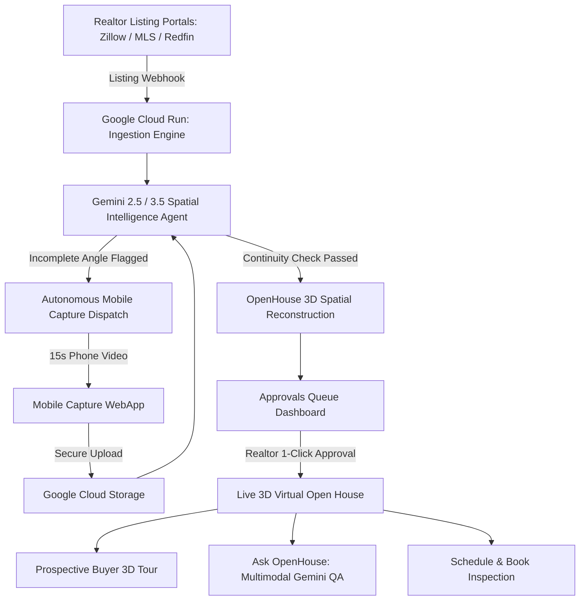

# OpenHouse 🏡
### Autonomous 3D Real Estate Inspection Layer Powered by Google Gemini & Google Cloud

> **Winner Submission for #AllThingsAgenticHackathon**  
> *Transforming static 2D listings into verified 3D virtual inspections autonomously.*

---

## 🌟 Overview & Problem Statement
The biggest bottleneck in modern real estate is physical viewings. Prospective tenants and buyers waste hours traveling to inspect properties, while realtors spend over 60% of their week scheduling visits that lead nowhere.

**OpenHouse solves this autonomously:**
1. **Zero New Workflow for Realtors:** Realtors upload photos & floor plans to their existing listing portals (MLS, Zillow, Redfin, Airbnb).
2. **Autonomous Gemini Ingestion:** OpenHouse ingests the listing webhook, uses **Gemini 2.5 Flash / 3.5** to validate spatial room continuity, and identifies missing spatial angles (e.g., unbridged balcony transitions).
3. **Instant Mobile Recapture Guide:** If an angle is missing, a 15-second guided mobile capture request is automatically dispatched to the agent’s phone.
4. **Interactive 3D Virtual Open House:** Once verified, OpenHouse publishes a photorealistic 3D inspection viewer with an interactive **Ask OpenHouse** multimodal AI assistant and direct inspection booking.

---

## 🛠️ Google Technologies Required & Disclosed

### 1. Google Gemini Models
- **Gemini 2.5 Flash & Gemini 3.5 Pro:** Multi-modal vision analysis evaluating room coverage, boundary transitions, daylight orientations, and spatial cross-referencing against architectural floor plans.
- **Multimodal Spatial QA:** Powers the *Ask OpenHouse* prospective buyer assistant in the 3D viewer.

### 2. Google Agent Framework
- **Google Gen AI SDK (`@google/genai`):** Autonomous agent workflows for spatial validation, prompt routing, and structured JSON output verification (`src/lib/gemini.ts`).

### 3. Google Cloud Services
- **Google Cloud Run:** Fully serverless container hosting for the OpenHouse application with instant autoscaling and HTTPS edge termination.
- **Google Cloud Build & Artifact Registry:** Automated containerized CI/CD pipeline defined in `cloudbuild.yaml` and multi-stage `Dockerfile`.
- **Google Cloud Storage (GCS):** Scalable storage bucket for raw video chunks and high-resolution spatial Gaussian splat assets.

---

## 📐 System Architecture Diagram



---

## 🚀 Quickstart & Spin-up Instructions (Reproducibility)

Follow these simple steps to run OpenHouse locally:

### 1. Clone the Repository
```bash
git clone https://github.com/Bigestdave/OpenHouse.git
cd OpenHouse
```

### 2. Install Dependencies
```bash
npm install
```

### 3. Run Development Server
```bash
npm run dev
```
Open **[http://localhost:5173](http://localhost:5173)** in your browser.

### 4. Build for Production
```bash
npm run build
npm run preview
```

---

## 🚢 Google Cloud Run Deployment

To deploy directly to Google Cloud Run:

```bash
# Set your Google Cloud Project
gcloud config set project YOUR_PROJECT_ID

# Build & Deploy using Google Cloud Build
gcloud builds submit --config cloudbuild.yaml .

# Or direct 1-command deploy to Cloud Run:
gcloud run deploy openhouse-app \
  --source . \
  --region us-central1 \
  --platform managed \
  --allow-unauthenticated
```

---

## 🔑 Demo Access & Testing Credentials

For Hackathon Judges and Evaluators:
- **Demo URL:** [http://localhost:5173/#/login](http://localhost:5173/#/login)
- **Quick Demo Login:** Click the button **"Quick Demo Login (David Olabowale)"** on the sign-in page to instantly access the workspace with zero friction.
- **Manual Stage Controller:** Press the backtick key (\`) anywhere in the application to access the hidden floating demo stage controller.

---

## 👥 Team & Disclosures
- **Author:** David Olabowale (@Bigestdave)
- **Built for:** Google All Things Agentic Hackathon
